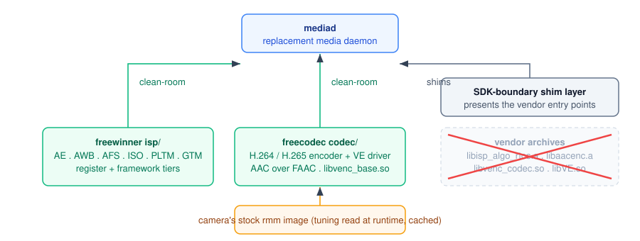

# freewinner — a vendor-free ISP and codec for Yi/V831 IP cameras

<div align="center">

<a href="LICENSE"></a>

**Independently written replacements for the proprietary Allwinner media stack on
sun8iw19p1 / V831-class Yi IP cameras: the libisp 3A core and the H.264/H.265
encoder + VE driver.**
**They build a `mediad` that links no vendor library at all and still streams
from the camera.**

</div>

> [!WARNING]
> **Early stage — not production firmware.** Both subprojects build and pass
> their unit tests, and the fully vendor-free `mediad` has streamed both channels
> on real hardware with zero decode errors. But this is a proof of concept: the
> SDK-boundary shim layer is experimental, and on-camera bring-up can wedge the
> sensor pipeline and require a reboot. See [Disclaimer](#disclaimer).

> [!NOTE]
> Not affiliated with Allwinner Technology or any camera vendor. **No vendor
> firmware, object files or binaries are distributed here** — the differential
> harnesses, captured register vectors and extracted tables live in a private
> workspace and are never published. Built with AI assistance under human review.
> See [Legal](#legal).

## Quick start

```sh
make -C isp check      # build and run the ISP unit tests
make -C codec check    # build and run the codec tests
```

Both build with no SDK and no vendor material. The codec's AAC unit needs a FAAC
source tree; if `FAAC_DIR` does not point at one, that unit is skipped and the
rest still runs.

## At a glance

|  |  |
| --- | --- |
| **What** | Clean-room reimplementations of the Allwinner libisp 3A core and the H.264/H.265 encoder + VE driver |
| **Hardware** | Yi IP cameras on sun8iw19p1 / V831 (y623 verified) |
| **Interface** | Vendor ABI reproduced behind a thin SDK-boundary shim |
| **Language** | C (ARMv7, musl) |
| **Status** | Proof of concept — both tiers verified on real hardware |
| **License** | AGPL-3.0-only (+ GNU AGPL section 7 vendor-encoder linking permission) |

## How it compares

|  | Vendor media stack | This project |
| --- | --- | --- |
| **ISP / 3A** | `libisp_algo_rtos.a` (proprietary archive) | clean-room `isp/` (AE, AWB, AFS, ISO, PLTM, GTM, register/framework tiers) |
| **H.264 / H.265** | `libvenc_codec.so` + `libVE.so` | clean-room `codec/` (encoder device, VE driver, `libvenc_base.so`) |
| **AAC** | `libaacenc.a` | freecodec wrapper over upstream FAAC |
| **Tuning** | compiled into the vendor blob | read at runtime from the camera's **own** `rmm` image, cached on SD |
| **Distribution** | binary-only | source, AGPL-3.0-only |

## How it works

The camera's stock media daemon, `rmm`, is built on proprietary archives
(`libisp_algo_rtos.a`, `libaacenc.a`, `libvenc_codec.a`, `libVE.a` and the encoder
support library). A replacement daemon (`mediad`) is linked against this project
instead. Both tiers are brought in through an SDK-boundary shim layer that
presents the vendor entry points, so the rest of `mediad` is unchanged.



| Component | Language | Role |
| --- | --- | --- |
| `isp/` | C | The 3A algorithms (AE, AWB, AFS, ISO, PLTM, GTM), the register/config tier, the framework tier and the runtime table locator |
| `codec/` | C | The H.264/H.265 encoder device, the VE driver (`/dev/cedar_dev`), the encoder support library/API framework, and the AAC-LC wrapper over FAAC |
| shim layer | C | Presents the vendor SDK entry points so `mediad` is unchanged |

Neither component ships the camera's tuning data: the tables are located at
runtime inside the camera's own stock `rmm` image, and the PLTM preset bank and
AE backlight-network output biases are extracted from the same image; all are
cached to the SD card, so only the first boot reads the vendor image (without
presets PLTM runs neutral; without the biases the backlight network is off). The
libraries do carry a small set of compiled-in tables — the platform default
configuration seed, one observed platform-default table (AF filter defaults), a
vendor-recovered constant (the CM colour-temperature interpolation knots), plus
the interface/dispatch/re-derived tables itemised in
[`isp/docs/provenance.md`](isp/docs/provenance.md) and
[`codec/docs/provenance.md`](codec/docs/provenance.md).

## Repository layout

```
isp/     reimplemented libisp 3A core, register and framework tiers, table locator, shim, specs
codec/   reimplemented H.264/H.265 encoder and VE driver, specs
```

Each subproject is self-contained: its own README, LICENSE, build and spec set.

## Verification

- `make -C isp check` — the ISP unit tests (`mk/*.mk` host binaries).
- `make -C codec check` — the codec host tests. Tests that need vectors which are
  not shipped (rate control, MB-RC table, the private differential suites) report
  `SKIP` without them; `codec/README.md` shows how to point them at a private copy.
- On camera: the vendor-free `mediad` streamed both channels and both decoded
  with zero macroblock errors.

## Roadmap / known limitations

- **Working:** the clean 3A cores and register tier, the clean H.264/H.265
  encoder and VE driver, the runtime table locator, and a full `mediad` link
  containing no vendor archive.
- **Not implemented:** standalone AF, rolloff and motion-detect — absent from the
  deployed blob, so there is no algorithm to reimplement from.
- **Experimental:** the SDK-boundary shim layer and the `rmm` table feed.
  On-camera bring-up can wedge the sensor pipeline after repeated runs; recovery
  is a reboot.
- **Documented exceptions:** the compiled-in tables above; no vendor *tuning*
  table is compiled in (the device's tuning is read at runtime from `rmm`). The
  OTP golden-ratio path (`otp_enable` / `pmsc_table` / `pwb_table`) is dead in the
  deployed image and no path here populates it.

## Changelog

- **2026-10-03** — repo flattened (`work/` removed); README restructured.
- **2026-09-30** — H.265/HEVC encoder device; VUI timing, configurable IDR,
  tracking rate control; encoder 3-D filter and OSN overlay.
- **2026-09-25** — register/base tier and framework re-produced from
  behaviour-only specs; provenance documented.
- **Initial** — clean-room 3A core and H.264 encoder/VE driver.

## Credits

See [CREDITS.md](CREDITS.md), and each subproject's own `CREDITS.md`.

<a id="legal"></a>
<details>
<summary><b>Legal</b></summary>

- **Not affiliated with, or endorsed by, Allwinner Technology** or any camera
  vendor. Product names and trademarks are used only for identification and
  interoperability.
- **No vendor firmware or binaries are distributed here.** The differential
  harnesses, captured register vectors and extracted tuning tables live in a
  private workspace. The only vendor material read at runtime is the camera
  owner's own stock `rmm` image, plus whatever SDK tree the builder supplies.
- **Interoperability reimplementation**, written for hardware the authors own.
- **AI-assisted.** Parts of this codebase were produced with large language
  models under a documented reimplementation process (see
  `isp/docs/provenance.md` and `codec/docs/provenance.md`).

</details>

<details>
<summary><b>Disclaimer</b></summary>

**This is a proof-of-concept project, not a production-ready system.** Large
parts were produced with LLMs under human supervision and testing — review and
verify everything yourself. **The software is provided "as is", without warranty
of any kind.** It performs invasive operations on embedded hardware, so you can
**brick the device, lose data and void warranties**; recovery may require
physical access and is never guaranteed. By using it you accept full
responsibility. **The authors and contributors are not liable for any loss or
damage arising from its use.**

</details>

## Security

Report vulnerabilities privately through
[GitHub Security Advisories](../../security/advisories/new). The build takes no
credentials; keep SDK and device paths out of tracked files.

## License

AGPL-3.0-only. See [LICENSE](LICENSE). The network clause is deliberate: these
components are designed to be linked into a device daemon that serves video over
a network. An additional permission under GNU AGPL section 7 allows combining
these components with the optional Allwinner vendor encoder libraries
(`libvenc_codec.so`, `libVE.so`) that a consuming daemon may load as a fallback:
see [LICENSE-EXCEPTION](LICENSE-EXCEPTION).
